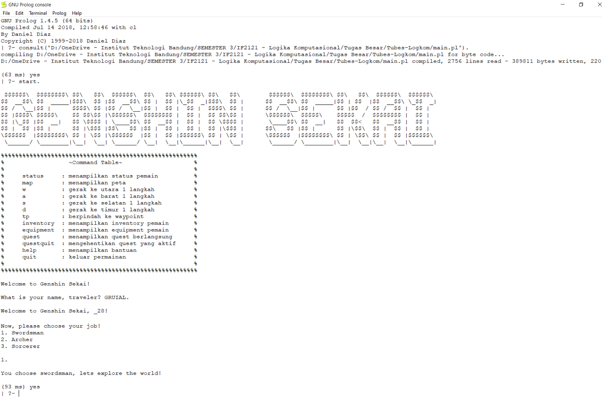

# Tugas Besar Logika Komputasional

## Abstrak
Membuat sebuah survival role-playing game di dunia baru sebagai seorang programmer dengan menggunakan bahasa pemrograman deklaratif Prolog (gunakan GNU Prolog).
Implementasi tugas besar harus mengandung materi: rekurens, list, cut, fail, dan loop.

Tujuan dari tugas besar ini adalah mengkombinasikan berbagai keterampilan dan teknik yang telah dipelajari dalam perkuliahan Logika Komputasional–IF2121, pra-praktikum, dan eksplorasi mandiri mengenai Logika Komputasional dan Prolog.

## Prasyarat
* GNU Prolog

## Cara Eksekusi Program
1. Seluruh file prolog (.pl) diletakkan dalam satu direktori (folder) yang sama.
2. Jalankan <b>main.pl</b> dengan mengklik kiri dua kali.
3. Masukkan perintah <b>start.</b> untuk memulai permainan.
4. Untuk input nama pemain, harap menggunakan huruf non-kapital. (e.g. <b>ather.</b> atau <b>lumine.</b>)
5. Untuk pilihan-pilihan dengan numbering dalam game, masukkan input angka saja diakhiri titik. (e.g. <b>1.</b>)
6. Untuk memilih item yang di-equip atau di-return, masukkan nama item tersebut diakhir titik. (e.g. <b>ultimate_sword.</b>)

## Tentang Kami
Kelas 02 Kelompok 12 <i>'Gacha rate up is a lie'</i>:  
1. Christopher Justine William (13519006)
2. Leonardus Brandon Luwianto (13519102)
3. Jusuf Junior Athala (13519174)
4. Aurelius Marcel Candra (13519198)

## Game CLI

